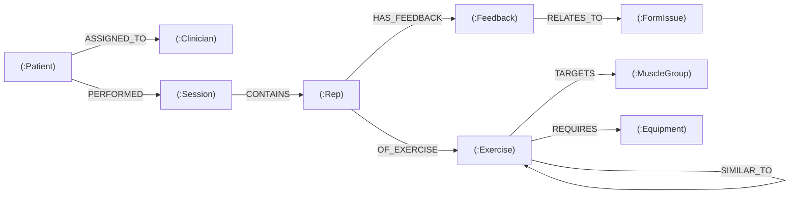

# My-PhysioForm-graph
A Streamlit web application that uses **CognoDB** (a managed graph database) to model physiotherapy exercise data. It demonstrates how graph traversals simplify relationship-centric queries.

## Why a Graph Database?

Physiotherapy data is inherently connected: patients perform sessions, sessions contain reps, reps are of exercises, and reps may have feedback related to form issues. Many important questions require traversing multiple levels of relationships:

- *Which patients have a specific form issue, and who is their clinician?*  
  This is a 3‑hop traversal: `Patient → Session → Rep → Feedback → FormIssue`.

- *Which patients share the same exercise and the same form issue?*  
  This requires matching two separate paths and comparing nodes, something that is extremely awkward with SQL joins but natural in Cypher.

A relational schema would need multiple tables and complex self‑joins to answer these questions. In a graph database, queries mirror the actual domain, making them easier to write, understand, and maintain.

## Data Model



Node Labels and Properties

· Patient: id, name, age, condition
· Clinician: id, name, specialty
· Session: id, date, duration_minutes
· Rep: id, rep_number, form_score
· Exercise: id, name, description
· Feedback: id, comment, severity
· FormIssue: id, name
· MuscleGroup: id, name
· Equipment: id, name

Main Cypher Queries

Multi‑hop traversal: Patients with a specific form issue

```cypher
MATCH (p:Patient)-[:PERFORMED]->(s:Session)-[:CONTAINS]->(r:Rep)-[:HAS_FEEDBACK]->(fb:Feedback)-[:RELATES_TO]->(fi:FormIssue {name: $issue_name})
OPTIONAL MATCH (r)-[:OF_EXERCISE]->(e:Exercise)
OPTIONAL MATCH (p)-[:ASSIGNED_TO]->(c:Clinician)
RETURN p.name AS patient, e.name AS exercise, c.name AS clinician, fb.severity AS severity
```

This query starts from a specific form issue and traverses backwards through feedback, rep, session, and patient to find all affected patients, their exercises, and their clinicians. A relational equivalent would require joining 5 tables.

Awkward in relational: Patient similarity by exercise and issue

```cypher
MATCH (p1:Patient)-[:PERFORMED]->(:Session)-[:CONTAINS]->(:Rep)-[:OF_EXERCISE]->(e:Exercise),
      (p1)-[:PERFORMED]->(:Session)-[:CONTAINS]->(:Rep)-[:HAS_FEEDBACK]->(:Feedback)-[:RELATES_TO]->(fi:FormIssue),
      (p2:Patient)-[:PERFORMED]->(:Session)-[:CONTAINS]->(:Rep)-[:OF_EXERCISE]->(e),
      (p2)-[:PERFORMED]->(:Session)-[:CONTAINS]->(:Rep)-[:HAS_FEEDBACK]->(:Feedback)-[:RELATES_TO]->(fi)
WHERE p1 <> p2
RETURN p1.name AS patient1, p2.name AS patient2, e.name AS exercise, fi.name AS issue, count(*) AS common_issues
ORDER BY common_issues DESC
```

This query finds pairs of patients who performed the same exercise and had the same form issue. In SQL, this would require multiple self‑joins across patient, session, rep, exercise, and feedback tables, making it hard to read and optimize.

Both queries are parameterized and executed through the official Neo4j driver.

Setup (Phone‑Friendly)

1. Create a CognoDB Instance

1. Go to CognoDB Console and sign up (free, no credit card).
2. Create a free c0 instance. Save the connection URI (bolt+s://<instance-id>.databases.cognodb.cloud) and the generated password for user cognodb (shown only once).

2. Set Up Replit (or any web IDE)

1. Go to replit.com and create a new Python repl.
2. Delete the default main.py.
3. Copy all the project files into the repl:
   · db.py, seed.py, queries.py, app.py, requirements.txt
   · (Optional: .streamlit/config.toml for theme)
4. In the Replit shell, install dependencies:
   ```bash
   pip install -r requirements.txt
   ```

3. Set Environment Variables

In Replit, go to the Secrets tab (lock icon) and add:

· COGNO_URI = your CognoDB URI
· COGNO_USER = cognodb
· COGNO_PASSWORD = your saved password

Alternatively, create a file named .env (copy .env.example) and fill in the values. Never commit .env to GitHub.

4. Seed the Database

In the Replit shell, run:

```bash
python seed.py
```

You should see Database seeded successfully.

5. Run the App Locally (in Replit)

```bash
streamlit run app.py
```

The app will open in a new tab. You can test it there.

6. Deploy to Streamlit Cloud (Hosted Demo)

1. Push your Replit project to a GitHub repository (Replit has a “Version Control” tab to connect GitHub).
2. Go to Streamlit Cloud and sign in with GitHub.
3. Click “New app”, select your repository and app.py.
4. In the app’s settings, add the same environment variables (COGNO_URI, COGNO_USER, COGNO_PASSWORD).
5. Deploy! You’ll get a public URL like https://your-app.streamlit.app.

7. Screen Recording

Use your phone’s built‑in screen recorder to capture a walkthrough of the app. Show the dashboard, patient detail, and run the two graph queries.

Error Handling

The app catches database connection errors and displays a friendly st.error message with the exception text. Loading states are shown using st.spinner while queries run.

Project Structure

```
.
├── app.py
├── db.py
├── seed.py
├── queries.py
├── requirements.txt
├── .env.example
├── .streamlit/
│   └── config.toml (optional)
└── README.md
```

License

MIT

```
```
